# KitchenSoup — Project Plan

## 1. Overview

KitchenSoup is a lightweight, self-hosted web application for preparing datasets, fine-tuning language models, managing model lineage and artifacts, evaluating results, quantizing outputs, and temporarily deploying fine-tuned models for testing.

The project is intentionally designed for non-technical users. A user should be able to start with documents or exported conversations, choose a supported base model, describe what they want the model to learn, launch a training job on available GPU infrastructure, compare the result with the base model, and create a deployable model artifact without needing to understand LoRA, learning rates, Kubernetes Jobs, SageMaker APIs, or vLLM internals.

KitchenSoup is not a training framework. It treats training engines as replaceable black boxes. The MVP uses [Soup](https://github.com/MakazhanAlpamys/Soup) as the fine-tuning and ingestion engine and [vLLM](https://github.com/vllm-project/vllm) as the inference engine.

KitchenSoup itself is intended to be released under the Apache License 2.0.

---

## 2. Product principles

KitchenSoup should follow these principles throughout implementation.

1. **Simple for non-technical users**
   - The default UI speaks in terms of user intent, documents, conversations, examples, models, and results.
   - ML-specific settings are hidden behind an Advanced section.
   - Every important transformation is previewable before an expensive training job starts.

2. **Small control plane**
   - FastAPI, PostgreSQL, Valkey, and an S3-compatible object store are sufficient for the MVP.
   - Avoid workflow engines, ML platforms, custom Kubernetes operators, and large frontend stacks.

3. **Black-box ML engines**
   - Soup is invoked through a container/CLI boundary.
   - vLLM is invoked through a separate container boundary.
   - KitchenSoup never depends on Soup's internal Python APIs or internal registry.

4. **Replaceable infrastructure**
   - Object storage, training executors, deployment executors, and LLM providers are interfaces.
   - The default implementation should be simple, but replacement with more advanced systems must not require rewriting the application.

5. **PostgreSQL is the source of truth**
   - Durable state, runs, datasets, models, artifacts, lineage, deployments, and event history live in PostgreSQL.
   - Valkey is used only for queueing, caching, locks, and transient notifications.

6. **Immutable runs**
   - Once submitted, a training run is an immutable snapshot.
   - Retries or configuration changes create a new run.

7. **Two independent lineages**
   - Model lineage tracks how logical model versions descend from other models.
   - Artifact lineage tracks how representations such as LoRA, merged BF16, AWQ, and evaluation reports are derived.

8. **Makefile-first developer experience**
   - Common development, testing, migration, container, and GPU workflows are available through `make`.

---

## 3. Target users

The primary user is not an ML engineer.

Typical users include people in:

- HR
- finance
- legal
- sales
- operations
- consulting
- support
- research
- management

These users commonly have:

- PDF, DOCX, Markdown, or text documents;
- exported ChatGPT conversations;
- examples of good answers or completed work;
- access to a workstation, a shared GPU machine, Kubernetes, or AWS;
- little or no knowledge of fine-tuning.

The UI must therefore help the user answer:

1. What should I upload?
2. What will the model actually learn from this?
3. Which model should I start from?
4. Where can I run the job?
5. Did fine-tuning improve anything?
6. Which artifact should I deploy?

---

## 4. MVP scope

### Included

- Single-user application.
- Optional external authentication through a reverse proxy such as OIDCGate.
- FastAPI + Jinja2 + HTMX + Alpine.js UI.
- PostgreSQL metadata database.
- Valkey-backed lightweight work queue.
- RustFS as the default S3-compatible object store in local deployments.
- Soup as the black-box ingestion and training engine.
- vLLM as the black-box inference engine.
- Curated base-model catalog, initially focused on small Qwen models.
- Ungated Hugging Face model support.
- User-uploaded Hugging Face/Transformers-compatible model artifacts.
- First-class ChatGPT export importer.
- Document ingestion through Soup.
- Canonical internal conversation and dataset representations.
- Dataset preview before training.
- Training intent + recipe model.
- Immutable application-owned AppSpec.
- Local Docker training.
- Docker-over-SSH training.
- Kubernetes Job training.
- SageMaker AI Training Jobs.
- Model registry independent of Soup.
- Model lineage and artifact lineage.
- Quantization as a post-training transformation.
- Temporary vLLM playground deployments.
- Local/SSH Docker vLLM deployment.
- Kubernetes vLLM deployment.
- SageMaker AI BYOC vLLM deployment.
- Small before/after evaluation workflow.
- Docker Compose development environment.
- Makefile workflows.

### Explicitly excluded from MVP

- Multi-user RBAC.
- Internal OAuth/OIDC implementation.
- Celery.
- Airflow.
- Temporal.
- Kubeflow.
- Argo Workflows.
- Ray.
- MLflow.
- custom Kubernetes operators.
- model gateways.
- large observability stacks.
- automatic universal compatibility detection for all Hugging Face models.
- multimodal fine-tuning.
- arbitrary checkpoint conversion.
- automatic deployment autoscaling.

---

## 5. High-level architecture

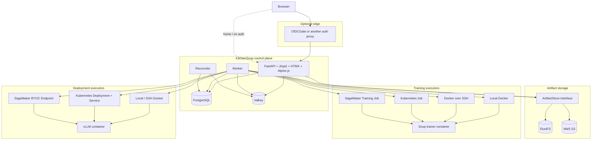

---

## 6. Core components

### 6.1 Web application

Technology:

- FastAPI
- Jinja2
- HTMX
- Alpine.js
- SQLAlchemy
- Alembic
- Pydantic

Responsibilities:

- HTML UI.
- JSON API.
- upload orchestration.
- creation of datasets, models, runs, evaluations, and deployments.
- AppSpec validation.
- presigned object upload/download creation.
- SSE status updates.
- model/dataset/artifact browsing.

The UI should not require Node.js or an npm build step for the MVP.

---

### 6.2 PostgreSQL

PostgreSQL is the durable source of truth.

It stores:

- model catalog entries;
- registered models;
- model versions;
- model lineage;
- datasets;
- dataset versions;
- documents/imports;
- canonical conversation metadata;
- training runs;
- immutable run specifications;
- generated Soup configuration;
- execution targets;
- artifacts;
- artifact lineage;
- evaluations;
- deployments;
- job event history.

JSONB can be used for versioned AppSpecs and executor-specific metadata, but core relationships and searchable identifiers should remain relational.

---

### 6.3 Valkey

Valkey is deliberately boring.

It is used for:

- lightweight job queue;
- idempotency/claim locks;
- short-lived state cache;
- SSE/pub-sub notifications;
- temporary leases.

It is not the durable store for job state.

The queue library should remain small. A lightweight Redis/Valkey-compatible library is preferred over Celery.

---

### 6.4 Artifact storage

KitchenSoup uses an `ArtifactStore` interface.

The synchronous port is defined in [app/storage/base.py](app/storage/base.py).
It provides `put`, bounded `get`, `stat`, `delete`, and presigned GET/PUT operations.
Blocking calls run in synchronous handlers or worker threads, consistent with
[ADR 0002](docs/adr/0002-artifact-storage.md). Upload registration verifies bytes
and separates temporary upload keys from registered artifact keys.

Default local implementation:

- S3-compatible client pointed at RustFS.

AWS implementation:

- normal AWS S3.

Large uploads should go directly from the browser to object storage through presigned URLs rather than proxying file bodies through FastAPI.

---

## 7. Authentication

KitchenSoup has no authentication subsystem in the MVP.

For home use:

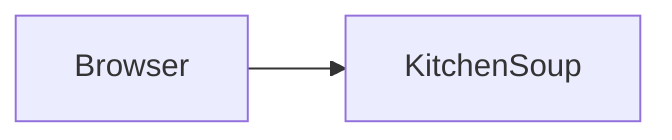

For work/network deployment:

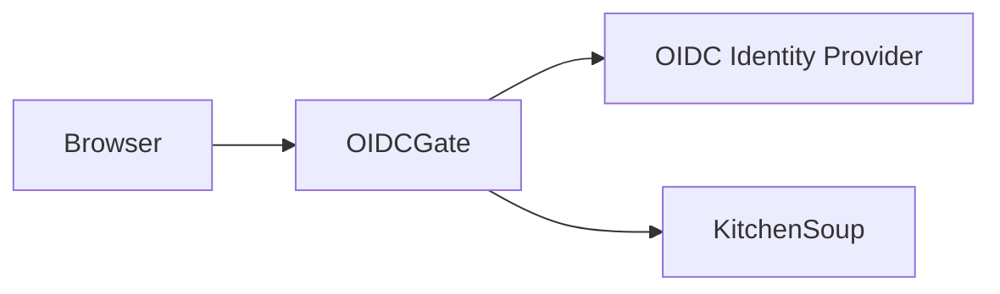

If multi-user semantics become necessary later, identity headers from the proxy can be introduced without replacing the external authentication pattern.

---

## 8. Model sources

KitchenSoup supports three model-source categories.

### 8.1 Curated catalog

The normal UI shows a small set of known-good models.

The initial catalog should focus on small Qwen models that are practical on developer GPUs.

A catalog entry records:

- display name;
- source repository;
- revision;
- architecture;
- parameter count;
- context length;
- license;
- whether the model is gated;
- Soup compatibility;
- vLLM compatibility;
- supported recipes;
- supported quantizations;
- approximate VRAM guidance.

The implemented catalog is version-controlled JSON synchronized into PostgreSQL;
see [ADR 0003](docs/adr/0003-model-registry.md) and [the model registry reference](docs/models.md).

### 8.2 Ungated Hugging Face models

Advanced users may specify:

- repository;
- revision.

KitchenSoup records the exact revision used in submitted runs.

### 8.3 Uploaded model artifact

A user may upload a Hugging Face/Transformers-compatible directory archive.

The MVP accepts archives containing the expected model configuration, tokenizer, and safe tensor files.

KitchenSoup validates that the artifact appears compatible with the configured training/serving engine.

KitchenSoup does not perform arbitrary checkpoint conversion in the MVP.

---

## 9. Model registry

KitchenSoup owns its own model registry.

Soup's internal registry is not authoritative and does not participate in application state.

A logical model version is separate from its concrete artifacts.

Example:

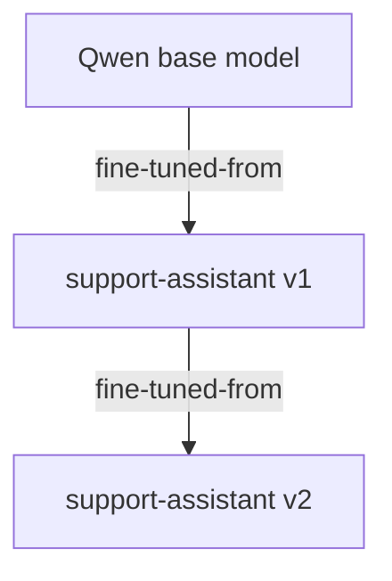

A model version may have several representations:

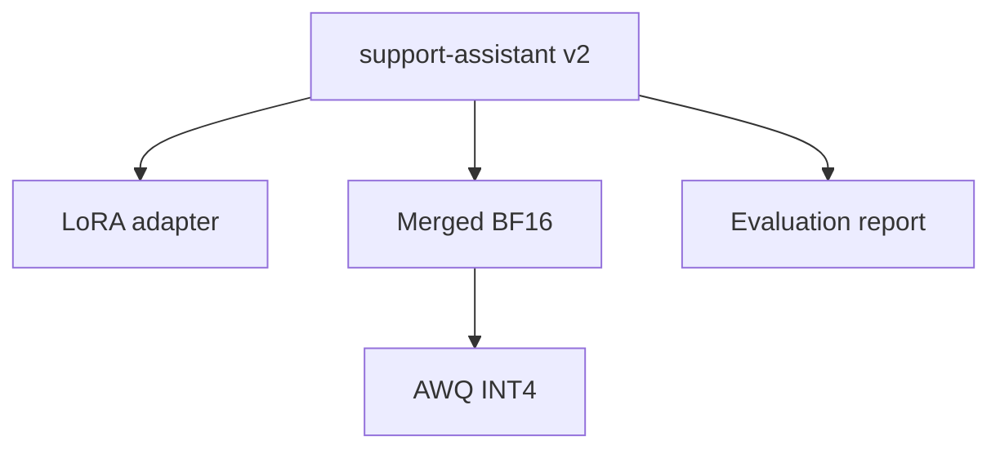

This separation allows:

- LoRA to remain the economical default;
- merged models to be generated lazily;
- quantizations to coexist;
- one logical model to have multiple deployment-compatible representations.

---

## 10. Licensing

Model licensing is visible in the UI and retained in the registry.

For every source model, KitchenSoup stores:

- source;
- exact revision;
- declared license;
- license reference/URL;
- gated status;
- user-supplied notes where needed.

Fine-tuned descendants retain source-license provenance.

Quantization or merging must not erase lineage or licensing metadata.

Datasets should also support optional license/source metadata where applicable.

KitchenSoup's own repository is intended to use Apache License 2.0.

---

## 11. Imports and canonical data

KitchenSoup distinguishes between:

1. raw imports;
2. canonical internal representations;
3. training datasets.

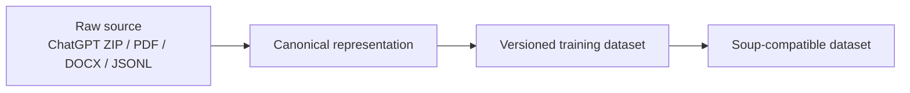

Raw sources are retained by default so importers can be improved later without requiring the user to re-upload the original material.

---

## 12. ChatGPT importer

ChatGPT exports are a first-class import path.

The user uploads the complete export ZIP.

KitchenSoup:

1. detects relevant conversation JSON files;
2. parses them into the internal canonical conversation schema;
3. lists conversations;
4. allows search and selection;
5. shows message counts and basic statistics;
6. builds training examples only from selected conversations;
7. previews the resulting examples before training.

The user should never be required to manually unzip the export.

Unsupported attachment or multimodal content should be clearly marked as ignored in the MVP rather than silently misinterpreted.

---

## 13. Canonical conversation format

The internal format is versioned and intentionally independent from ChatGPT and Soup contracts.

Example:

```json
{
  "schema": "kitchensoup.conversation/v1",
  "conversation_id": "source-specific-id",
  "title": "Quarterly review",
  "source": "chatgpt",
  "messages": [
    {
      "role": "user",
      "content": [
        {
          "type": "text",
          "text": "Can you rewrite this?"
        }
      ]
    },
    {
      "role": "assistant",
      "content": [
        {
          "type": "text",
          "text": "Certainly..."
        }
      ]
    }
  ],
  "metadata": {}
}
```

Future importers may include:

- Claude exports;
- Gemini exports;
- Slack;
- Teams;
- generic OpenAI-style JSONL.

Each importer converts only to the canonical schema.

---

## 14. Document ingestion

KitchenSoup relies on Soup for document ingestion wherever practical.

The initial Soup document CLI supports PDF, DOCX, Markdown and plain text.
Structured JSONL/CSV remain raw sources until a suitable conversion mode is added.
The [document-ingestion reference](docs/documents.md) defines the implemented
limits, immutable extraction history and versioned intermediate artifacts.
Dataset manifests and resolved training-example preview remain Milestone 8.

KitchenSoup should retain:

- original document;
- object hash;
- importer/ingestion version;
- normalized/derived dataset artifacts;
- warnings.

KitchenSoup should not implement its own general-purpose document parsing stack in the MVP.

---

## 15. Training intent and recipes

Non-technical users choose an intent rather than raw ML configuration.

Initial intents:

### Respond like these conversations

Suitable for learning style, structure, response patterns, and recurring behavior from example conversations.

### Perform a task from examples

Suitable for extraction, classification, rewriting, transformation, or similar example-driven tasks.

### Learn from these documents

A guided workflow for document-based adaptation. The UI must warn users when fine-tuning is unlikely to be the correct mechanism for changing factual knowledge.

### Advanced

Expose lower-level Soup/training options.

A versioned recipe resolves intent into concrete defaults.

---

## 16. Dataset preview

Dataset preview is an MVP feature.

Before training, the user sees:

- number of selected source files/conversations;
- number of usable examples;
- ignored/unsupported items;
- sample input/output pairs;
- warnings;
- approximate dataset size.

Example UI:

> We found 143 conversations and created 1,421 training examples.\
> 31 unsupported tool/system-only items were ignored.

The user may inspect examples before submitting a run.

This is a core safety and usability feature for non-technical users.

---

## 17. External LLM providers

KitchenSoup supports OpenAI-compatible LLM APIs for dataset preparation and future assisted workflows.

Configuration is provider-based:

```yaml
llm_providers:
  - id: default
    name: OpenAI
    base_url: https://api.openai.com/v1
    api_key_ref: env://OPENAI_API_KEY
    models:
      - configured-model-name

  - id: work
    name: Company LiteLLM
    base_url: https://llm.example.internal/v1
    api_key_ref: env://LITELLM_API_KEY
    models:
      - fast
      - smart
```

The application uses a small interface such as:

```python
class LLMProvider(Protocol):
    async def chat(self, request: ChatRequest) -> ChatResponse: ...
    async def structured_output(self, request: StructuredRequest) -> dict: ...
```

The MVP uses explicitly configured model names rather than depending on provider model discovery.

The UI must clearly identify when source data will be sent to an external LLM provider.

---

## 18. AppSpec

KitchenSoup owns an authoritative, versioned AppSpec.

The AppSpec records the user's request independently from Soup configuration.

Example:

```yaml
apiVersion: kitchensoup/v1
kind: TrainingRun

intent:
  type: conversation_imitation

base_model:
  ref: model:qwen-small

dataset:
  ref: dataset:my-chatgpt-style:v3

recipe:
  ref: recipe:conversation-sft-default

executor:
  ref: executor:local-gpu

outputs:
  keep_adapter: true
  merge: false
  quantizations: []
```

At submission time the immutable run snapshot additionally stores resolved values:

```yaml
resolved:
  base_model:
    source: huggingface
    repository: ...
    revision: ...

  training:
    epochs: ...
    learning_rate: ...
    lora:
      enabled: true
      rank: ...

  engine:
    name: soup
    version: ...
    image_digest: ...
    generated_config: |
      ...
```

The user-facing intent remains understandable while the resolved snapshot remains reproducible.

Every schema is versioned:

- `kitchensoup.appspec/v1`;
- `kitchensoup.conversation/v1`;
- `kitchensoup.dataset-manifest/v1`.

---

## 19. Soup boundary

Soup is always treated as a black-box container/CLI.

KitchenSoup never imports Soup internals.

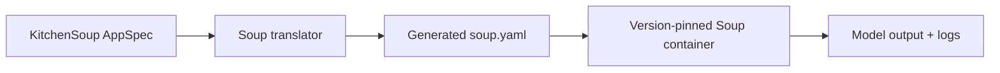

The translator layer isolates KitchenSoup from Soup configuration changes.

A submitted run records:

- AppSpec version;
- generated Soup configuration;
- Soup version;
- Soup container image;
- container digest;
- model revision;
- dataset version.

Training and serving use separate images because their accelerator and Python dependency sets may differ.

---

## 20. Training executor interface

Training infrastructure is abstracted behind a common contract.

```python
class TrainingExecutor(Protocol):
    async def submit(self, run: ResolvedRun) -> ExternalJob: ...
    async def status(self, external_id: str) -> JobStatus: ...
    async def cancel(self, external_id: str) -> None: ...
    async def logs(self, external_id: str, cursor: str | None = None) -> LogChunk: ...
```

MVP implementations:

- `LocalDockerTrainingExecutor`
- `SshDockerTrainingExecutor`
- `KubernetesTrainingExecutor`
- `SageMakerTrainingExecutor`

Executor-specific configuration remains outside the training recipe.

---

## 21. Local Docker training

Local Docker is the first executor implemented.

The runner launches the pinned Soup training image with:

- NVIDIA GPU access;
- immutable run spec;
- dataset input;
- output workspace;
- explicit environment;
- deterministic container name.

The executor supports:

- submit;
- inspect;
- logs;
- cancel;
- cleanup.

This executor enables complete end-to-end development on a gaming PC.

---

## 22. Docker-over-SSH training

No remote KitchenSoup agent is required.

The control plane uses Docker over SSH or normal SSH commands.

Two artifact transfer modes are supported by the abstraction:

### SSH transfer

Safe MVP default.

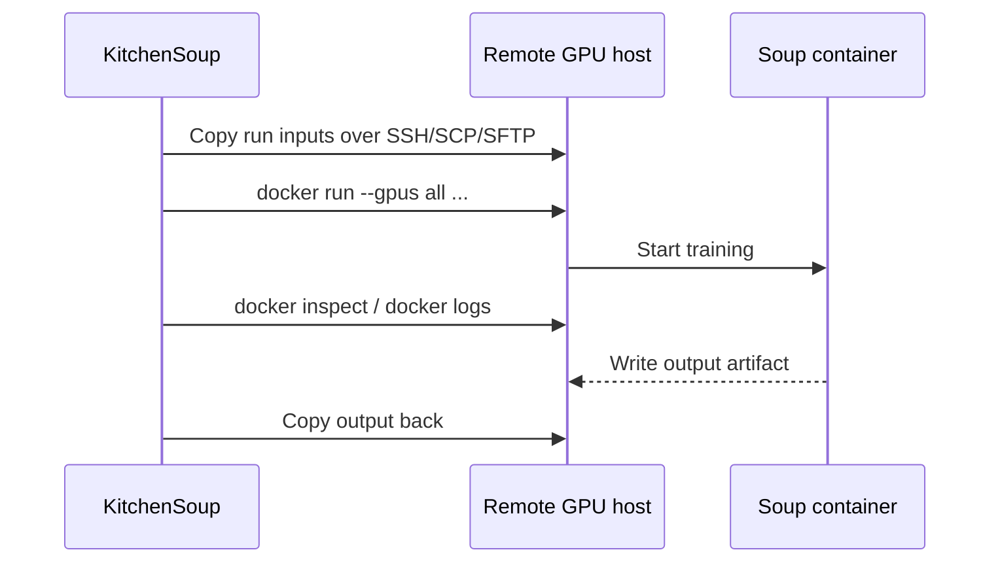

This works even when the remote GPU host cannot reach local RustFS.

### Direct object transfer

Optional later mode.

The remote runner receives presigned object URLs and downloads/uploads directly.

---

## 23. Kubernetes training

Training is a normal Kubernetes Job.

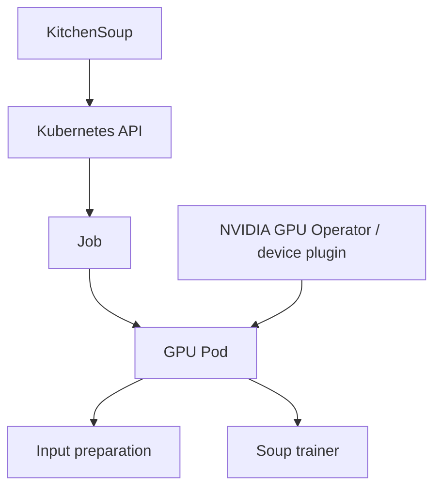

The application assumes the cluster GPU stack already exists.

KitchenSoup does not install the NVIDIA GPU Operator.

Initial configurable fields:

- namespace;
- image;
- GPU count;
- optional node selector;
- optional tolerations;
- service account/credential reference.

---

## 24. SageMaker training

SageMaker is implemented as another executor.

KitchenSoup:

1. stages required artifacts to AWS S3 if necessary;
2. starts a SageMaker Training Job using a pinned Soup training image in ECR;
3. polls `DescribeTrainingJob`;
4. reads logs/status;
5. imports the output artifact into the model registry/object store.

The common Soup runner adapts to SageMaker filesystem conventions.

AWS-specific state remains executor metadata and does not leak into the AppSpec's training semantics.

---

## 25. Job state

KitchenSoup owns normalized job state.

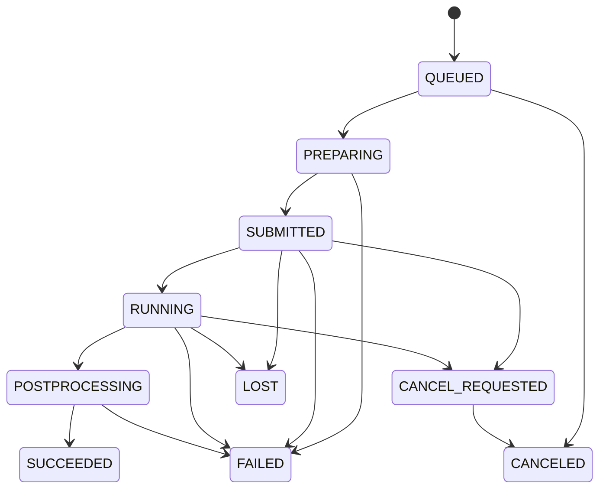

Every transition is appended to `job_events`.

Runs remain immutable even if execution fails.

A retry clones the previous run into a new run.

---

## 26. Worker and reconciler

The worker handles short commands:

- prepare dataset;
- submit training;
- request cancellation;
- postprocess artifact;
- quantize artifact;
- deploy model;
- stop deployment.

The reconciler handles long-running external state.

Its logic is intentionally simple:

1. query PostgreSQL for non-terminal jobs;
2. claim each job with a lock;
3. call the appropriate executor's `status`;
4. update normalized state if necessary;
5. append a job event;
6. publish a transient UI update through Valkey.

No workflow engine is required.

---

## 27. Credentials

Execution targets and providers never store raw long-lived secrets in normal application records.

They store `credential_ref`.

Initial forms:

- `env://NAME`
- `file:///run/secrets/name`
- `aws-profile://profile`

Future forms may include:

- `vault://...`
- `aws-secrets-manager://...`
- `kubernetes-secret://...`

Examples:

```yaml
execution_targets:
  - id: remote-gpu
    type: ssh-docker
    host: gpu.example.internal
    credential_ref: file:///run/secrets/gpu_ssh_key
```

---

## 28. Artifact processing and quantization

Quantization is a post-training artifact transformation.

It is not treated as part of logical model identity.

Initial representations:

- LoRA adapter;
- merged BF16/FP16;
- AWQ INT4.

Additional formats can be added later.

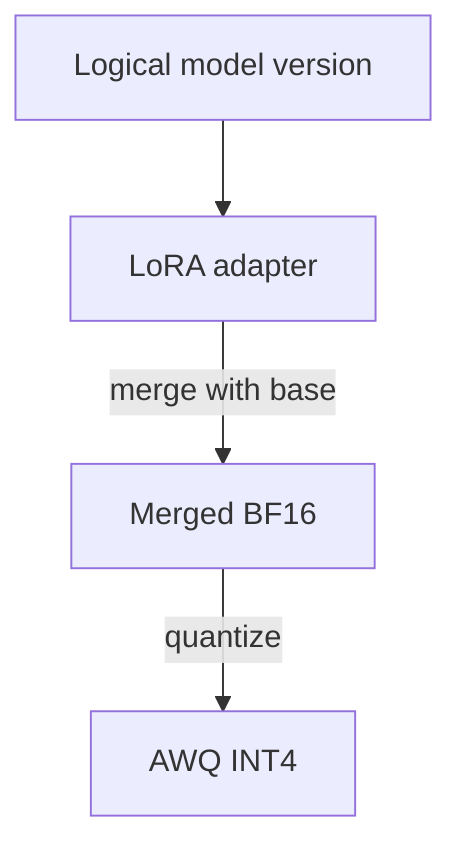

Merged artifacts should be created lazily unless explicitly requested.

This keeps storage consumption low.

---

## 29. Evaluation

KitchenSoup includes a deliberately small evaluation workflow.

Before training, the user may add a small set of test prompts.

After training, KitchenSoup compares the base model and fine-tuned model side by side.

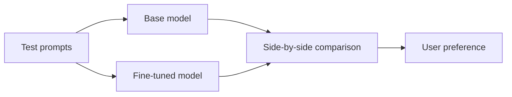

For each prompt, the user may mark:

- Base better
- Fine-tuned better
- Same

The resulting evaluation is stored as an artifact/report.

The MVP does not require automated benchmark infrastructure.

---

## 30. Deployment

Deployment is separate from training.

```python
class DeploymentExecutor(Protocol):
    async def deploy(self, spec: DeploymentSpec) -> ExternalDeployment: ...
    async def status(self, external_id: str) -> DeploymentStatus: ...
    async def stop(self, external_id: str) -> None: ...
```

Initial implementations:

- `LocalDockerDeploymentExecutor`
- `SshDockerDeploymentExecutor`
- `KubernetesDeploymentExecutor`
- `SageMakerDeploymentExecutor`

vLLM is the default serving engine.

---

## 31. Temporary playground

The first deployment experience is a temporary playground.

A playground deployment has:

- model version;
- selected artifact;
- target executor;
- endpoint;
- `expires_at`;
- optional activity-based lease extension.

The UI exposes:

- chat/test interface;
- remaining lease;
- stop now;
- keep running.

This prevents an accidental long-lived GPU reservation during experimentation.

---

## 32. Docker vLLM deployment

Local or remote Docker deployment runs a pinned vLLM image.

Responsibilities:

- materialize/download the selected model artifact;
- start vLLM with NVIDIA GPU access;
- expose an OpenAI-compatible endpoint;
- track container identity;
- stop and clean up on lease expiry.

Training and serving images remain separate.

---

## 33. Kubernetes vLLM deployment

The executor creates:

- a `Deployment`;
- a `Service`;
- optionally an init container for model download.

The MVP may use `emptyDir` for model materialization.

Future replacements may include:

- shared PVC cache;
- node-local NVMe cache;
- CSI object-store integration;
- more advanced serving operators.

The application interface should not depend on those choices.

---

## 34. SageMaker vLLM deployment

KitchenSoup supports SageMaker AI Bring Your Own Container inference.

The executor manages the SageMaker model, endpoint configuration, and endpoint lifecycle using a pinned vLLM-compatible image.

SageMaker-specific endpoint state remains normalized into the common deployment state model.

---

## 35. UI structure

Primary navigation:

- Home
- Models
- Datasets
- Runs
- Deployments
- Settings

### Main model creation workflow

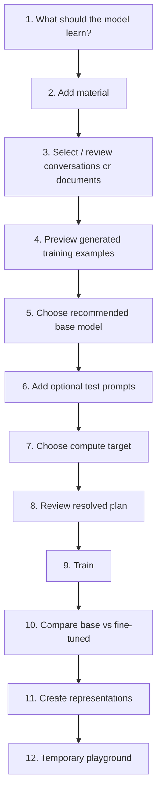

The generated Soup configuration should be visible under Advanced details before submission.

---

## 36. Proposed PostgreSQL entities

The exact schema may evolve, but the MVP should include at least:

### Registry

- `models`
- `model_versions`
- `model_version_parents`
- `model_sources`

### Artifact graph

- `artifacts`
- `artifact_derivations`

### Dataset graph

- `datasets`
- `dataset_versions`
- `dataset_sources`
- `documents`
- `conversation_imports`
- `conversations`

### Execution

- `training_runs`
- `job_events`
- `execution_targets`
- `quantization_jobs`

### Evaluation and serving

- `evaluation_suites`
- `evaluation_prompts`
- `evaluation_results`
- `deployments`

### Configuration

- `llm_providers`
- `model_catalog_entries`

Raw secrets are not stored in provider/target rows.

---

## 37. Object key layout

The object layout should be predictable but not authoritative; PostgreSQL remains the source of truth.

Example:

```text
raw/
  documents/<uuid>/<filename>
  chatgpt/<uuid>/export.zip
  models/<uuid>/<filename>

canonical/
  conversations/<dataset-version>/conversations.jsonl
  documents/<dataset-version>/...

datasets/
  <dataset-version>/manifest.json
  <dataset-version>/train.jsonl

runs/
  <run-id>/appspec.yaml
  <run-id>/soup.yaml
  <run-id>/logs/...

models/
  <model-version-id>/adapter/...
  <model-version-id>/merged-bf16/...
  <model-version-id>/awq-int4/...

evaluations/
  <evaluation-id>/report.json
```

Objects should have content hashes recorded in PostgreSQL.

---

## 38. API shape

The UI may use the same endpoints or dedicated HTMX endpoints, but the core JSON API should expose resources such as:

```text
GET    /api/models
POST   /api/models/import
GET    /api/models/{id}

GET    /api/datasets
POST   /api/datasets
POST   /api/datasets/{id}/uploads/presign
POST   /api/datasets/{id}/imports/chatgpt
GET    /api/datasets/{id}/preview

POST   /api/runs
GET    /api/runs/{id}
POST   /api/runs/{id}/cancel
POST   /api/runs/{id}/clone
GET    /api/runs/{id}/logs
GET    /api/runs/{id}/events

POST   /api/artifacts/{id}/merge
POST   /api/artifacts/{id}/quantize

POST   /api/evaluations
GET    /api/evaluations/{id}

POST   /api/deployments
GET    /api/deployments/{id}
POST   /api/deployments/{id}/stop
POST   /api/deployments/{id}/extend

GET    /api/execution-targets
GET    /api/llm-providers
```

The API should be designed so a future SPA can replace the Jinja UI without replacing backend services.

---

## 39. Repository structure

Suggested structure:

```text
kitchensoup/
├── app/
│   ├── api/
│   ├── ui/
│   │   ├── templates/
│   │   └── static/
│   ├── db/
│   ├── models/
│   ├── schemas/
│   ├── services/
│   ├── importers/
│   ├── recipes/
│   ├── storage/
│   ├── providers/
│   ├── training_engines/
│   ├── executors/
│   ├── deployment_executors/
│   ├── worker/
│   └── reconciler/
│
├── images/
│   ├── soup-trainer/
│   └── vllm/
│
├── deploy/
│   ├── compose/
│   ├── kubernetes/
│   └── aws/
│
├── tests/
│   ├── unit/
│   ├── integration/
│   ├── e2e/
│   └── fixtures/
│
├── alembic/
├── pyproject.toml
├── docker-compose.yml
├── Makefile
├── .env.example
├── LICENSE
├── PLAN.md
├── TODO.md
└── README.md
```

---

## 40. Docker Compose development environment

The local stack should contain:

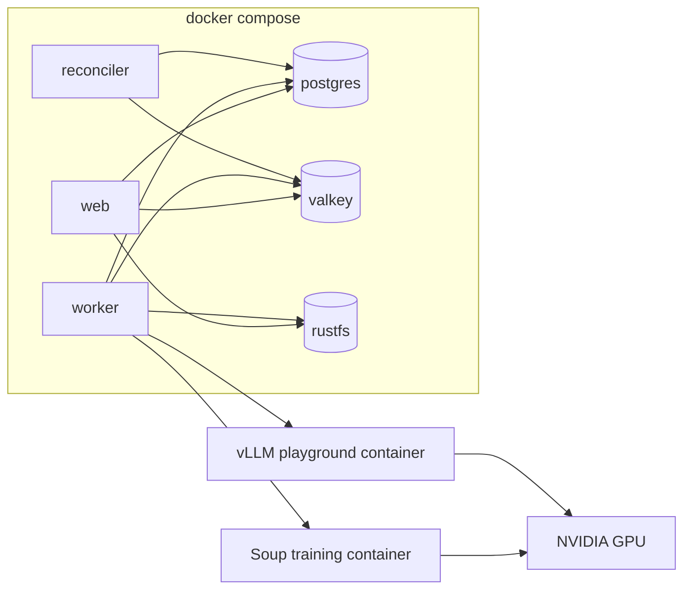

In development, the worker may mount the Docker socket so local training/deployment containers can be launched as sibling containers.

---

## 41. Makefile developer contract

The repository should expose simple workflows.

Recommended targets:

```text
make help
make setup
make up
make down
make restart
make logs
make ps

make migrate
make migration

make fmt
make lint
make test
make test-unit
make test-integration
make test-e2e

make gpu-check
make test-gpu

make build
make build-soup
make build-vllm

make shell
make db-shell
make clean
```

No contributor should need to memorize raw Docker Compose, Alembic, pytest, Ruff, or image-build commands for normal workflows.

---

## 42. Testing strategy

### Unit tests

Test without external services where possible:

- AppSpec validation;
- canonical conversation parsing;
- ChatGPT importer fixtures;
- recipe resolution;
- lineage rules;
- state transitions;
- credential-ref parsing;
- object key generation;
- Soup config translation.

### Integration tests

Run using Docker Compose:

- PostgreSQL;
- Valkey;
- RustFS;
- object uploads/downloads;
- migrations;
- queue dispatch;
- reconciler behavior;
- API resource lifecycle.

### GPU integration tests

Opt-in tests:

- GPU detection;
- Soup container launch;
- tiny training smoke test;
- vLLM startup;
- inference request;
- playground expiry.

These tests must not be required for normal CI.

### Executor contract tests

Every executor should satisfy a reusable contract test suite with fake or local backends where possible.

---

## 43. Error handling

Errors should be translated into user-facing explanations.

Examples:

Instead of:

> CUDA out of memory

show:

> This model and recipe do not fit on the selected GPU. Try a smaller model, a lower-memory recipe, or a larger GPU.

Instead of:

> HTTP 403 from Hugging Face

show:

> KitchenSoup could not download this model. It may be gated or require authentication.

Detailed raw errors and logs remain accessible under Advanced / Logs.

---

## 44. Observability

MVP observability remains lightweight.

Use:

- structured application logs;
- job event history in PostgreSQL;
- container/external job logs;
- simple health endpoints;
- optional Prometheus-compatible metrics later.

Avoid introducing a mandatory monitoring stack.

---

## 45. Security

MVP security assumptions:

- single trusted user or trusted network;
- optional OIDCGate at the perimeter;
- no secrets stored directly in normal database records;
- presigned object URLs are short-lived;
- uploaded archives are treated as untrusted input;
- archive extraction must prevent path traversal and zip bombs;
- execution targets are explicitly configured by the operator;
- raw vLLM endpoints should not be broadly exposed without network controls/proxying.

---

## 46. Upgrade seams

KitchenSoup should make these future replacements possible without major redesign:

| MVP component | Future replacement |
|---|---|
| Jinja/HTMX | React/Next or another SPA |
| Valkey queue | more advanced queue/workflow system |
| RustFS | AWS S3, MinIO, Ceph, R2 |
| Soup | Axolotl, LLaMA-Factory, custom trainer |
| vLLM | other serving engines |
| Docker-over-SSH | host agent / scheduler |
| Kubernetes Job | training operator |
| simple eval | automated benchmark/eval platform |
| curated model YAML | dynamic compatibility catalog |
| external auth proxy | first-class multi-user identity/RBAC |

The interfaces should exist where replacement is plausible, but abstractions must stay small until there is a real second implementation.

---

## 47. Recommended implementation order

The current implementation frontier is Milestone 8: dataset manifests and preview.
Soup document extraction is documented in [docs/documents.md](docs/documents.md).
Canonical ChatGPT import and draft conversation selection are documented in [docs/conversations.md](docs/conversations.md).
Dataset creation and raw-source admission are documented in [docs/datasets.md](docs/datasets.md).
Model browsing and import are documented in [docs/models.md](docs/models.md).
Artifact storage and its versioned upload API are documented in [docs/storage.md](docs/storage.md).
The database foundation and migration workflow are documented in [docs/database.md](docs/database.md).
The developer workflow and local infrastructure are documented in [docs/development.md](docs/development.md).

Implementation should proceed in vertical slices:

1. repository/development environment;
2. database and basic web shell;
3. object storage;
4. model catalog and registry;
5. raw uploads and ChatGPT canonical importer;
6. dataset preview;
7. AppSpec + recipes;
8. Soup runner container;
9. local Docker end-to-end training;
10. queue/reconciler/job UI;
11. model/artifact lineage;
12. evaluation prompts;
13. temporary vLLM playground;
14. merge + AWQ post-processing;
15. Docker-over-SSH;
16. Kubernetes;
17. SageMaker;
18. production polish.

The corresponding detailed implementation checklist lives in `TODO.md`.

---

## 48. Definition of MVP success

KitchenSoup's MVP is successful when a non-technical user can:

1. start KitchenSoup with Docker Compose;
2. upload a ChatGPT export or supported documents;
3. select source conversations/documents;
4. preview the training examples;
5. choose a recommended small model;
6. optionally add several test prompts;
7. launch fine-tuning on the local NVIDIA GPU;
8. watch job progress;
9. receive a registered model version with lineage;
10. compare base and fine-tuned responses;
11. create a merged/quantized representation;
12. launch a temporary vLLM playground;
13. repeat the same workflow on a remote Docker-over-SSH machine without changing the dataset or model definition.

Kubernetes and SageMaker then prove that the executor boundaries generalize beyond the local/SSH MVP.
