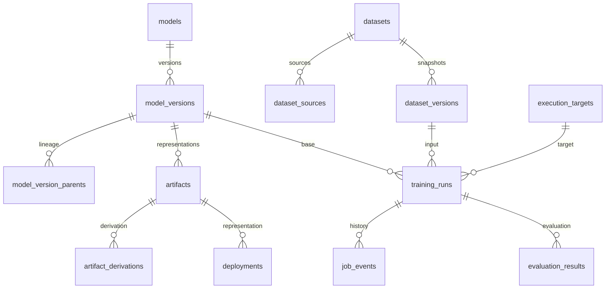

# Database foundation

The schema is internal application metadata, defined by the Alembic revisions
and mapped in `app/db/models.py`. Its rationale is recorded in
[ADR 0001](adr/0001-database-foundation.md).

## Development workflow

```sh
make setup
make migrate
make migration-check
```

`make migrate` starts PostgreSQL, builds the application image, and runs
`alembic upgrade head` in a disposable application container. It works before
`make up` and does not require RustFS or Valkey. Repeating it preserves data and
does nothing when the database is already at head. `make up` does not migrate
automatically. Run migrations explicitly before using database-backed features.

To change the schema:

1. Edit the ORM source definitions in `app/db/models.py`.
2. Ensure the development database is at the existing migration head.
3. Run `make migration MESSAGE="describe the schema change"`.
4. Review the generated revision under `alembic/versions/`, then run `make fmt`.
5. Run `make test-integration`, `make migrate`, and `make migration-check`.

The migration generator bind-mounts the checkout and runs with the host UID/GID,
so revision files persist in the checkout. Generate against this application's
database only. Alembic may propose dropping tables it does not recognize.
Autogeneration detects relational differences but does not manage trigger
functions; add reviewed SQL revisions for those changes. Do not rewrite an
applied revision or import live ORM metadata into its upgrade/downgrade logic.

The first revision was generated from ORM metadata. The second contains
hand-authored immutable-record and timestamp triggers. `make migration-check`
checks ORM/schema drift; the integration tests check trigger behavior separately.
Downgrade tests run only in the disposable test database, never against local
application data. Downgrading the initial schema removes all application tables.

## Sessions and transactions

`create_database_engine(Settings())` creates a SQLAlchemy engine using the
existing PostgreSQL settings. It uses a URL object so special characters in
passwords are handled correctly and represented passwords are redacted.
SQLAlchemy parameter logging is disabled with `hide_parameters=True`.
The caller disposes the engine when its process lifecycle ends.

```python
from sqlalchemy.orm import sessionmaker

from app.config import Settings
from app.db.repositories import ModelRepository
from app.db.session import create_database_engine, unit_of_work

engine = create_database_engine(Settings())
factory = sessionmaker(engine, expire_on_commit=False)
try:
    with unit_of_work(factory) as session:
        model = ModelRepository(session).add("My model")
        session.commit()
finally:
    engine.dispose()
```

The repository flushes to obtain an ID but does not commit. Changes to a loaded
model are tracked by SQLAlchemy; use `session.commit()` to persist them.
Exiting without a commit, including after an exception, rolls back. A session
belongs to one unit of work and is not shared between threads or requests.
The initial model repository is small; other services can use their own
repositories over the same session as they are introduced.

## Tables

Every table includes `id`, `created_at`, and `updated_at`. UUIDs are assigned on
insert (by SQLAlchemy or the PostgreSQL default), rather than on Python object
construction. Updates cannot change IDs or creation timestamps. PostgreSQL
updates `updated_at` on mutable rows, including updates issued outside the ORM.

| Table | Initial responsibility |
| --- | --- |
| `model_catalog_entries` | Stable catalog key, repository/revision, license, compatibility details |
| `models` | Logical model name and description |
| `model_versions` | Positive version number unique within a model |
| `model_version_parents` | Unique child/parent version edges; direct self-parenting rejected |
| `model_sources` | Version source, exact revision where applicable, license provenance, optional catalog/artifact links |
| `artifact_uploads` | Temporary upload reservation, completion deadline, and registered artifact link |
| `artifacts` | Bucket/key location, size, format, SHA-256, optional model-version owner |
| `artifact_derivations` | Separate unique artifact child/parent edges and operation |
| `datasets` | Logical dataset name, description, optional license |
| `dataset_versions` | Immutable numbered manifest snapshot, schema label, SHA-256, optional manifest artifact |
| `dataset_sources` | Raw artifact link, filename, source kind, optional license |
| `documents` | Source/title/media type and optional canonical artifact |
| `conversation_imports` | Raw source, importer/schema versions, optional canonical artifact |
| `conversations` | Import-scoped source conversation identity and browsing metadata |
| `execution_targets` | Target kind, non-secret configuration, credential reference |
| `llm_providers` | Base URL, configured model names, API-key reference |
| `evaluation_suites` | Named evaluation grouping |
| `evaluation_prompts` | Ordered prompts, position unique within a suite |
| `training_runs` | Immutable base/dataset/target/input snapshot with mutable execution status/identifier |
| `job_events` | Append-only, per-run sequenced event history |
| `evaluation_results` | Run/prompt/model links, response artifact, optional preference |
| `deployments` | Model/artifact/target links, execution status, endpoint, expiry |

Foreign-key indexes support joins; status and deployment-expiry indexes support
future polling. References use restrictive foreign keys, so deleting a model
cannot silently erase its versions, artifacts, or runs. Logical names may repeat
except catalog keys and operator-configured target/provider names. Identical
content hashes may occur at different object locations; hashes are not identities.
An artifact's bucket/key pair is unique within the configured object store.



## Boundaries and remaining validation

Snapshot hashes and manifests are supplied by callers. The database checks hash
format and snapshot immutability, but canonical hashing and public JSON schema
validation arrive in the dataset/AppSpec milestones. Insert dataset versions
only after their complete snapshot is available; draft assembly belongs outside
these immutable rows. The initial run table represents submitted snapshots,
not editable drafts. Status changes do not yet enforce the transition graph or
automatically append an event; Milestone 13 adds that service behavior.

Credential-reference fields require URI-shaped references and never resolve
them. Configuration, URLs, JSON snapshots, and event messages are not places
for resolved secrets or sensitive runtime payloads. Concrete provider/target
validation is deferred. Foreign keys establish existence, while deeper workflow
consistency (such as a deployment's artifact matching its selected model,
evaluation-suite membership, and transitive lineage cycles) belongs to later
services and migrations. No resource API is published by this milestone.

## Verification

`make verify` runs service-free checks. `make test-integration` launches a uniquely
named PostgreSQL 18 container with a random credential passed via environment,
a loopback-only ephemeral port, and tmpfs storage. The runner waits for TCP
readiness, tests, and removes the container even after failure. It never uses
the development stack's database or volumes. It requires a local Docker daemon.

The PostgreSQL suite covers all 22 tables, foreign keys, uniqueness, hash/reference
constraints, CRUD, explicit commit and rollback, timestamps, immutable IDs,
snapshots, event history, and downgrade/upgrade/repeated upgrade. It also compares
the migrated schema to ORM metadata. CI runs the same Make target.

Upstream references: [SQLAlchemy sessions](https://docs.sqlalchemy.org/en/20/orm/session_basics.html)
and [Alembic autogeneration](https://alembic.sqlalchemy.org/en/latest/autogenerate.html).

Conversation metadata now includes a mutable `selected` draft flag (false by default)
and an array of ignored-content warning codes. Migration `953d3fcf27d6` adds these
fields to existing rows; the existing identity/timestamp guard still applies.
See [canonical import and selection](conversations.md).

Document ingestion adds immutable `document_ingestions` snapshots with numbered
per-dataset attempts, output/log/manifest artifact references and provenance JSON.
Its relational migration is generated; a separate trigger rejects updates.
See [ADR 0006](adr/0006-soup-document-ingestion.md).
